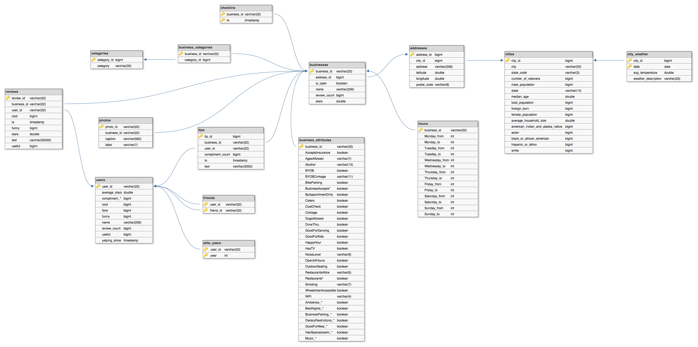
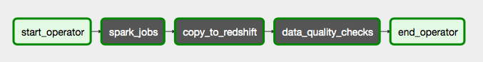
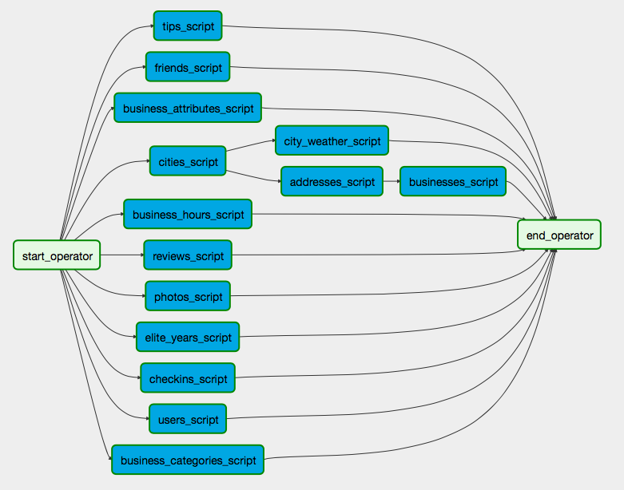
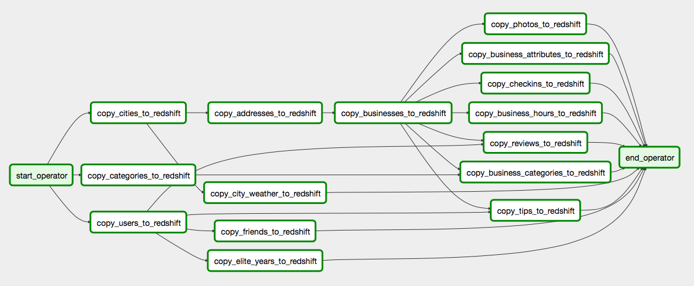
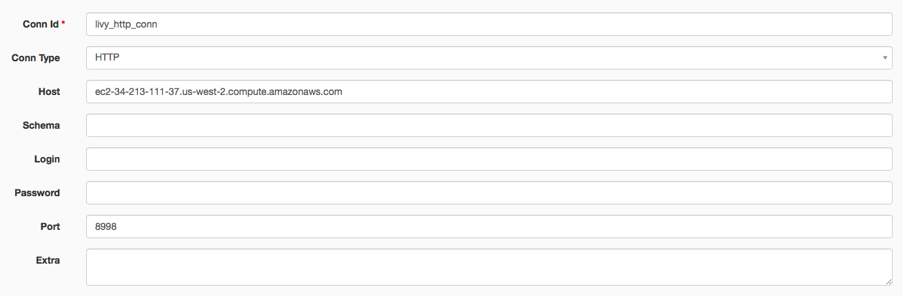
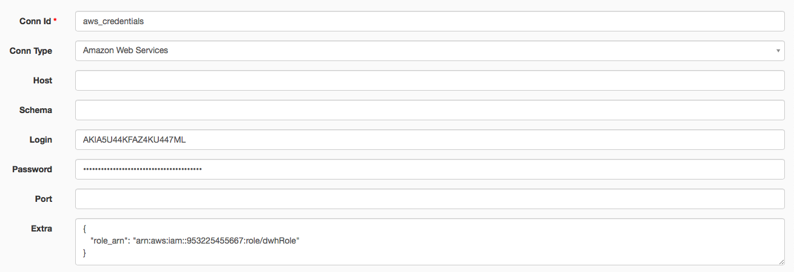
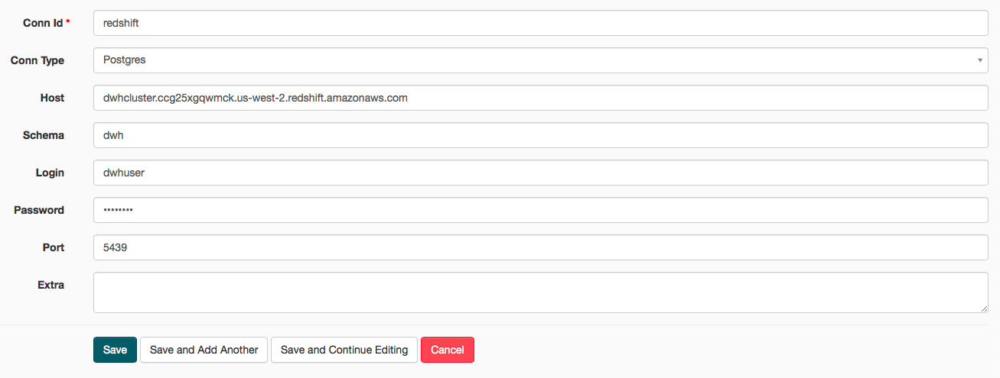

# yelp-3nf

The developed data pipeline translates the non-relational Yelp dataset distributed over JSON files in Amazon S3 bucket, into a 3NF-normalized dataset stored on Amazon Redshift. The resulting data model was designed to be a source of truth for further dimensional tables. Additionally, the data was enriched with demographics and weather data coming from third-party data sources. The entire process was done using Apache Spark, Amazon Redshift and Apache Airflow.

## Datasets


The [Yelp Open Dataset](https://www.yelp.com/dataset) is a perfect candidate for this project, since: 

- (1) it is a NoSQL data source; 
- (2) it comprises of 6 files that count together more than 10 million rows; 
- (3) this dataset provides lots of diverse information and allows for many analysis approaches, from traditional analytical queries (such as "*Give me the average star rating for each city*") to Graph Mining, Photo Classification, Natural Language Processing, and Sentiment Analysis; 
- (4) Moreover, it was produced in a real production setting (as opposed to synthetic data generation). 

To make the contribution unique, the Yelp dataset was enriched by demographics and weather data. This allows the end user to make queries such as "*Does the number of ratings depend upon the city's population density?*" or "*Which restaurants are particularly popular during hot weather?*".

### Yelp Open Dataset

The [Yelp Open Dataset](https://www.yelp.com/dataset) dataset is a subset of Yelp's businesses, reviews, and user data, available for academic use. The dataset (as of 13.08.2019) takes 9GB disk space (unzipped) and counts 6,685,900 reviews, 192,609 businesses over 10 metropolitan areas, over 1.2 million business attributes like hours, parking, availability, and ambience, 1,223,094 tips by 1,637,138 users, and aggregated check-ins over time. Each file is composed of a single object type, one JSON-object per-line. For more details on dataset structure, proceed to [Yelp Dataset JSON Documentation](https://www.yelp.com/dataset/documentation/main).

### U.S. City Demographic Data

The [U.S. City Demographic Data](https://public.opendatasoft.com/explore/dataset/us-cities-demographics/export/) dataset contains information about the demographics of all US cities and census-designated places with a population greater or equal to 65,000. This data comes from the US Census Bureau's 2015 American Community Survey. Each JSON object describes the demographics of a particular city and race, and so it can be uniquely identified by the city, state and race fields. More information can be found [here](https://public.opendatasoft.com/explore/dataset/us-cities-demographics/information/) under the section "Dataset schema".

### Historical Hourly Weather Data 2012-2017

The [Historical Hourly Weather Data](https://www.kaggle.com/selfishgene/historical-hourly-weather-data) dataset is a dataset collected by a Kaggle competitor. The dataset contains 5 years of hourly measurements data of various weather attributes, such as temperature, humidity, and air pressure. This data is available for 27 bigger US cities, 3 cities in Canada, and 6 cities in Israel. Each attribute has it's own file and is organized such that the rows are the time axis (timestamps), and the columns are the different cities. Additionally, there is a separate file to identify which city belongs to which country.

## Data model and dictionary

Our target data model is a 3NF-normalized relational model, which was designed to be neutral to different kinds of analytical queries. The data should depend on the key [1NF], the whole key [2NF] and nothing but the key [3NF] (so help me Codd). Forms beyond 4NF are mainly of academic interest. The following image depicts the logical model of the database:



Note: fields such as *compliment_&ast;* are just placeholders for multiple fields with the same prefix (*compliment*). This is done to visually reduce the length of the tables.

The model consists of 15 tables as a result of normalizing and joining 6 tables provided by Yelp, 1 table with demographic information and 2 tables with weather information. The schema is closer to a Snowflake schema as there are two fact tables - *reviews* and *tips* - and many dimensional tables with multiple levels of hierarchy and many-to-many relationships. Some tables keep their native keys, while for others monotonically increasing ids were generated. Rule of thumb: Use generated keys for entities and composite keys for relationships. Moreover, timestamps and dates were converted into Spark's native data types to be able to import them into Amazon Redshift in a correct format.

For more details on tables and fields, visit [Yelp Dataset JSON](https://www.yelp.com/dataset/documentation/main) or look at [Redshift table definitions](https://github.com/polakowo/yelp-3nf/blob/master/airflow/dags/configs/table_definitions.yml).

To dive deeper into the data processing pipeline with Spark, here is [the provided Jupyter Notebook](https://nbviewer.jupyter.org/github/polakowo/yelp-3nf/blob/master/spark-jobs-playground.ipynb).

#### *businesses*

The most referenced table in the model. Contains the name of the business, the current star rating, the number of reviews, and whether the business is currently open. The address (one-to-one relationship), hours (one-to-one relationship), businesses attributes (one-to-one relationship) and categories (one-to-many relationship) were outsourced to separate tables as part of the normalization process.

#### *business_attributes*

This was the most challenging part of the remodeling, since Yelp kept business attributes as nested dict. All fields in the source table were strings, so they had to be parsed into respective data types. Some values were dirty, for example, boolean fields can be `"True"`, `"False"`, `"None"` and `None`, while some string fields were of double unicode format `u"u'string'"`. Moreover, some fields were dicts formatted as strings. The resulting nested JSON structure of three levels had to be flattened.

#### *business_categories* and *categories*

In the original table, business categories were stored as an array. The best solution was to outsource it into a separate table. One way of doing this is to assign a column to each category, but what if we are going to add a new category later on? Then we must update this whole table to reflect the change - this is a clear violation of the 3NF, where columns should not have any transitional function relations. Thus, let's create two tables: *categories*, which contains categories keyed by their ids, and *business_categories*, which contains tuples of business ids and category ids.

#### *business_hours*

Business hours were stored as a dict where each key is day of week and value is string of format `"hour:minute-hour:minute"`. The best way to make the data representation neutral to queries, is to split the "from hour" and "to hour" parts into separate columns and combine "hour" and "minute" into a single field of type integer, for example `"10:00-21:00"` into `1000` and `2100` respectively. This way we could easily formulate the following query:

```sql
-- Find businesses opened on Sunday at 8pm
SELECT business_id FROM business_hours WHERE Sunday_from <= 2000 AND Sunday_to > 2000;
```

#### *addresses*

A common practice is to separate business data from address data and connect them though a synthetic key. The resulting link is a one-to-one relationship. Furthermore, addresses were separated from cities, since states and demographic data are dependent on cities only (otherwise 3NF violation). 

#### *cities*

This table contains city name and state code coming from the Yelp dataset and fields on demographics. For most of the cities there is no demographic information since they are too small (< 65k). Each record in the table can be uniquely identified by the city and postal code, but a single primary key is more convenient to connect both addresses and cities.

#### *city_weather*

The table *city_weather* was composed out of CSV files `temperature.csv` and `weather_description.csv`. Both files contain information on various (global) cities. To filter the cities by country (= US), one first has to read the `city_attributes.csv`. The issue with the dataset is that it doesn't provide us with the respective state codes, so how do we know whether Phoenix is in AZ or TX? The most appropriate solution is finding the biggest city. This can be done manually with Google: find the respective state codes and then match these with the cities available in the Yelp dataset. As a result, 8 cities could be enriched. Also, both the temperatures and weather description data were recorded hourly, which is too fine-grained. Thus, they were grouped by day by applying an aggregation statistic: temperatures (of data type `float`) are averaged, while for weather description (of data type `string`) the most frequent one is chosen.

#### *checkins*

This table contains checkins on a business and required no further transformations.

#### *reviews*

The *reviews* table contains full review text data including the user id that wrote the review and the business id the review is written for. It is the most central table in our data schema and structured similarly to a fact table. But in order to convert it into a fact table, the date column has to be outsourced into a separate dimension table and the text has to be omitted.

#### *users*, *elite_years* and *friends*

Originally, the user data includes the user's friend mapping and all the metadata associated with the user. But since the fields `friends` and `elite` are arrays, they have become separate relations in our model, both structured similarly to the *business_categories* table and having composite primary keys. The format of the table *friends* is a very convenient one, as it can be directly fed into Apache Spark's GraphX API to build a social graph of Yelp users.

#### *tips*

Tips were written by a user on a business. Tips are shorter than reviews and tend to convey quick suggestions. The table required no transformations apart from assigning it a generated key.

#### *photos*

Contains photo data including the caption and classification.

## Data pipeline

The designed pipeline dynamically loads the JSON files from S3, processes them, and stores their normalized and enriched versions back into S3 in Parquet format. After this, Redshift takes over and copies the tables into a DWH.

#### Load from S3


All three datasets reside in a Amazon S3 bucket, which is the easiest and safest option to store and retrieve any amount of data at any time from any other AWS service. 

#### Process with Spark


Since the data is in JSON format and contains arrays and nested fields, it needs first to be transformed into a relational form. By design, Amazon Redshift does not support loading nested data (only Redshift Spectrum enables you to query complex data types such as struct, array, or map, without having to transform or load your data). To do this in a quick and scalable fashion, Apache Spark is utilized. In particular, you can execute the entire data processing pipeline in [the provided ETL notebook](https://nbviewer.jupyter.org/github/polakowo/yelp-3nf/blob/master/spark-jobs-playground.ipynb) an Amazon EMR (Elastic MapReduce) cluster, which uses Apache Spark and Hadoop to quickly & cost-effectively process and analyze vast amounts of data. The another advantage of Spark is the ability to control data quality, thus most of our data quality checks are done at this stage.

#### Unload to S3


Parquet stores nested data structures in a flat columnar format. Compared to a traditional approach where data is stored in row-oriented approach, parquet is more efficient in terms of storage and performance. Parquet files are well supported in the AWS ecosystem. Moreover, compared to JSON and CSV formats, we can store timestamp objects, datetime objects and long texts without any post-processing, and load them into Amazon Redshift as-is. From here, we can use an AWS Glue crawler to discover and register the schema for our datasets to be used in Amazon Athena. But our goal is materializing the data rather than querying directly from files on Amazon S3 - to be able to retrieve the data without prolonged load times. 

#### Load into Redshift


To load the data from Parquet files into our Redshift DWH, we can rely on multiple options. The easiest one is by using [spark-redshift](https://github.com/databricks/spark-redshift): Spark reads the parquet files from S3 into the Spark cluster, converts the data to Avro format, writes it to S3, and finally issues a COPY SQL query to Redshift to load the data. Or we can have [an AWS Glue job that loads data into an Amazon Redshift](https://www.dbbest.com/blog/aws-glue-etl-service/). But instead, we should define the tables manually: that way we can control the quality and consistency of data, but also sortkeys, distkeys and compression. This solution issues SQL statements to Redshift to first CREATE the tables and then to COPY the data. To make the table definition process easier and more transparent, we can utilize the AWS Glue's data catalog to derive the correct data types (for example, should we use int or bigint?).

#### Check data quality

Most data checks are done when transforming data with Spark. Furthermore, consistency and referential integrity checks are done automatically by importing the data into Redshift (since data must adhere to table definition). To ensure that the output tables are of the right size, we also do some checks the end of the data pipeline.

## Airflow DAGs


The following data processing pipeline is executed by using Apache Airflow, which is a tool for orchestrating complex computational workflows and data processing pipelines. The advantage of Airflow over Python ETL scripts is that it provides many add-on modules for operators that already exist from the community, such that one can build useful stuff quickly and in a modular fashion. Also, Airflow scheduler is designed to run as a persistent service in an Airflow production environment and is easier to manage than cron jobs. 

The whole data pipeline is divided into three subDAGs: the one that processes data with Spark (`spark_jobs`), the one that loads the data into Redshift (`copy_to_redshift`), and the one that checks the data for errors (`data_quality_checks`).



### spark_jobs

This subDAG comprises of a set of tasks, each sending Spark script to an Amazon EMR cluster. For this, the [LivySparkOperator](https://github.com/rssanders3/airflow-spark-operator-plugin) is used. This operator facilitates interacting with the Livy Server on the EMR master node, which lets us send simple Scala or Python code over REST API calls instead of having to manage and deploy large JAR files. This helps because it scales data pipelines easily with multiple spark jobs running in parallel, rather than running them serially using EMR Step API. Each Spark script takes care of loading one or more source JSON files, transforming it into one or more (3NF-normalized) tables, and unloading them back into S3 in parquet format. The subDAG was partitioned logically by target tables, such that each script takes care of a small amount of work to simplify debugging. Note: in order to increase the performance, one might divide the tasks by the source tables and cache them.



### copy_to_redshift

Airflow takes control of loading Parquet files into Redshift in right order and with consistency checks in place. The loading operation is done with the [S3ToRedshiftOperator](https://github.com/airflow-plugins/redshift_plugin), provided by the Airflow community. This operator takes the table definition as a dictionary, creates the Redshift table from it and performs the COPY operation. All table definitions are stored in a YAML configuration file. The order and relationships between operators were derived based on the references between tables; for example, because *reviews* table references *businesses*, *businesses* have to be loaded first, otherwise, the referential integrity is violated (and you may get errors). Thus, data integrity and referential constraints are automatically enforced while populating the Redshift database.



### data_quality_checks

The data quality checks are executed with a custom [RedshiftCheckOperator](https://github.com/polakowo/yelp-3nf/blob/master/airflow/plugins/redshift_plugin/operators/redshift_check_operator.py), which extends the Airflow's default [CheckOperator](https://github.com/apache/airflow/blob/master/airflow/operators/check_operator.py). It takes a SQL statement, the expected pass value, and optionally the tolerance of the result, and performs a simple value check.

## Date updates

The whole ETL process for 7 million reviews and related data lasts about 20 minutes. As our target data model is meant to be the source for other dimensional tables, the ETL process can take longer time. Since the Yelp Open Dataset is only a subset of the real dataset and we don't know how many rows Yelp generates each day, we cannot derive the optimal frequency of the updates. But taking only newly appended rows (for example, those collected for one day) can significantly increase the frequency.

## Scenarios

The following scenarios needs to be addressed:
- **The data was increased by 100x:** That wouldn't be a technical issue as both Amazon EMR and Redshift clusters can handle huge amounts of data. Eventually, they would have to be scaled out.
- **The data populates a dashboard that must be updated on a daily basis by 7am every day:** That's perfectly plausible and could be done by running the ETL script some time prior to 7am.
- **The database needed to be accessed by 100+ people:** That wouldn't be a problem as Redshift is highly scalable and available.

## Installation

### Data preparation (Amazon S3)

- Create an S3 bucket. 
    - Ensure that the bucket is in the same region as your Amazon EMR and Redshift clusters.
    - Be careful with read permissions - you may end up having to pay lots of fees in data transfers.
- Option 1:
    - Download [Yelp Open Dataset](https://www.yelp.com/dataset) and directly upload to your S3 bucket (`yelp_dataset` folder).
- Option 2 (for slow internet connections):
    - Launch an EC2 instance with at minimum 20GB SSD storage.
    - Connect to this instance via SSH (click "Connect" and proceed according to AWS instructions)
    - Proceed to the dataset homepage, fill in your information, copy the download link, and paste into the command below. Note: the link is valid for 30 seconds.
    ```bash
    wget -O yelp_dataset.tar.gz "[your_download_link]"
    tar -xvzf yelp_dataset.tar.gz
    ```
    - Finally, transfer the files as described by [this blog](http://codeomitted.com/transfer-files-from-ec2-to-s3/)
    - Remember to provide IAM role and credentials of user who has AmazonS3FullAccess.
    - In case your instance has no AWS CLI installed, follow [this documentation](https://docs.aws.amazon.com/cli/latest/userguide/cli-chap-install.html)
    - In case you come into errors such as "Unable to locate package python3-pip", follow [this answer](https://askubuntu.com/questions/1061486/unable-to-locate-package-python-pip-when-trying-to-install-from-fresh-18-04-in#answer-1061488)
- Download the JSON file from [U.S. City Demographic Data](https://public.opendatasoft.com/explore/dataset/us-cities-demographics/export/)
    - Upload it to a separate folder (`demo_dataset`) on your S3 bucket.
- Download the whole dataset from [Historical Hourly Weather Data 2012-2017](https://www.kaggle.com/selfishgene/historical-hourly-weather-data/downloads/historical-hourly-weather-data.zip)
    - Unzip and upload `city_attributes.csv`, `temperature.csv`, and `weather_description.csv` files to a separate folder (`weather_dataset`) on your S3 bucket.
    
### Amazon EMR

- Configure and create your EMR cluster.
    - Go to advanced options, and enable Apache Spark, Livy and AWS Glue Data Catalog for Spark.
    - Enter the following configuration JSON to make Python 3 default:
```json
[
  {
     "Classification": "spark-env",
     "Configurations": [
       {
         "Classification": "export",
         "Properties": {
            "PYSPARK_PYTHON": "/usr/bin/python3"
          }
       }
    ]
  }
]
```
- Go to EC2 Security Groups, select your master node and enable inbound connections to 8998.

### Amazon Redshift

- Store your credentials and cluster creation parameters in `dwh.cfg`
- Run `create_cluster.ipynb` to create a Redshift cluster.
- Note: Delete your Redshift cluster with `delete_cluster.ipynb` when you're finished working.

### Apache Airflow

- Use [Quick Start](https://airflow.apache.org/start.html) to make a local Airflow instance up and running.
- Copy `dags` and `plugins` folders to your Airflow work environment (under `AIRFLOW_HOME` path variable)
- Create a new HTTP connection `livy_http_conn` by providing host and port of the Livy server.



- Create a new AWS connection `aws_credentials` by providing user credentials and ARN role (from `dwh.cfg`)



- Create a new Redshift connection `redshift` by providing database connection parameters (from `dwh.cfg`)



- In the Airflow UI, turn on and manually run the DAG "main". 

## Further resources

- [Yelp's Academic Dataset Examples](https://github.com/Yelp/dataset-examples)
- [Spark Tips & Tricks](https://gist.github.com/dusenberrymw/30cebf98263fae206ea0ffd2cb155813)
- [Use Pyspark with a Jupyter Notebook in an AWS EMR cluster](https://towardsdatascience.com/use-pyspark-with-a-jupyter-notebook-in-an-aws-emr-cluster-e5abc4cc9bdd)
- [Real-world Python workloads on Spark: EMR clusters](https://becominghuman.ai/real-world-python-workloads-on-spark-emr-clusters-3c6bda1a1350)
